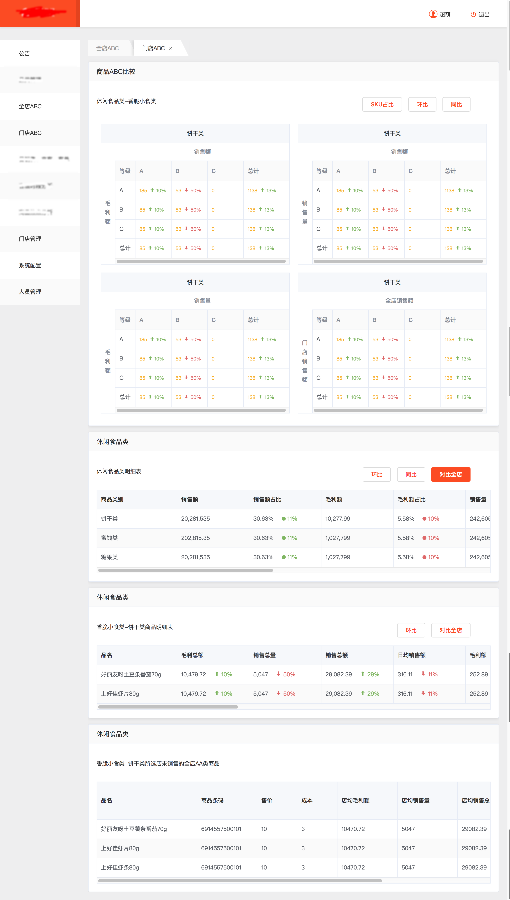
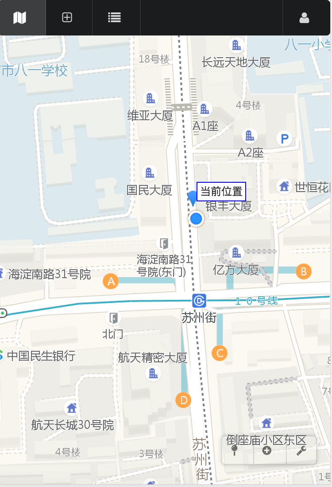
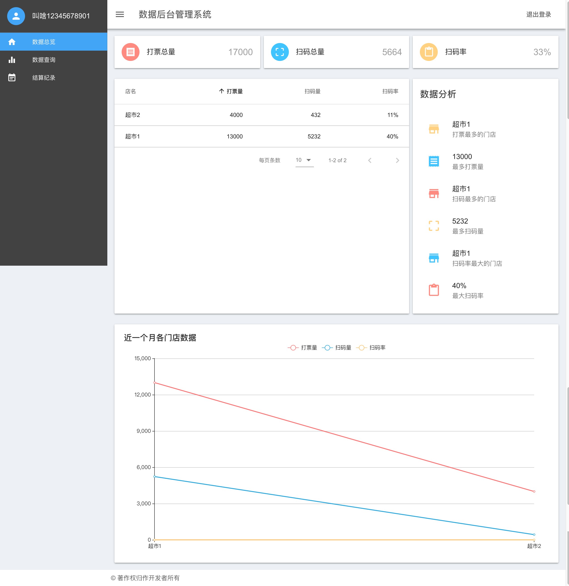
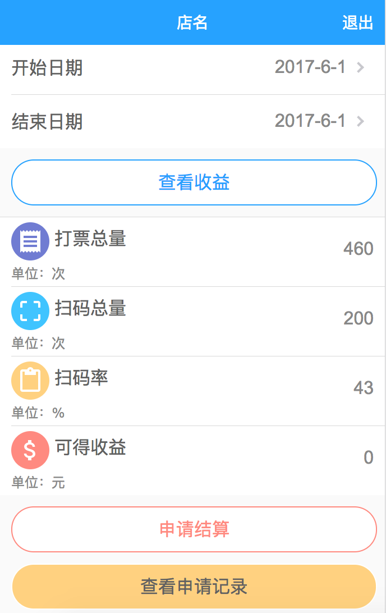
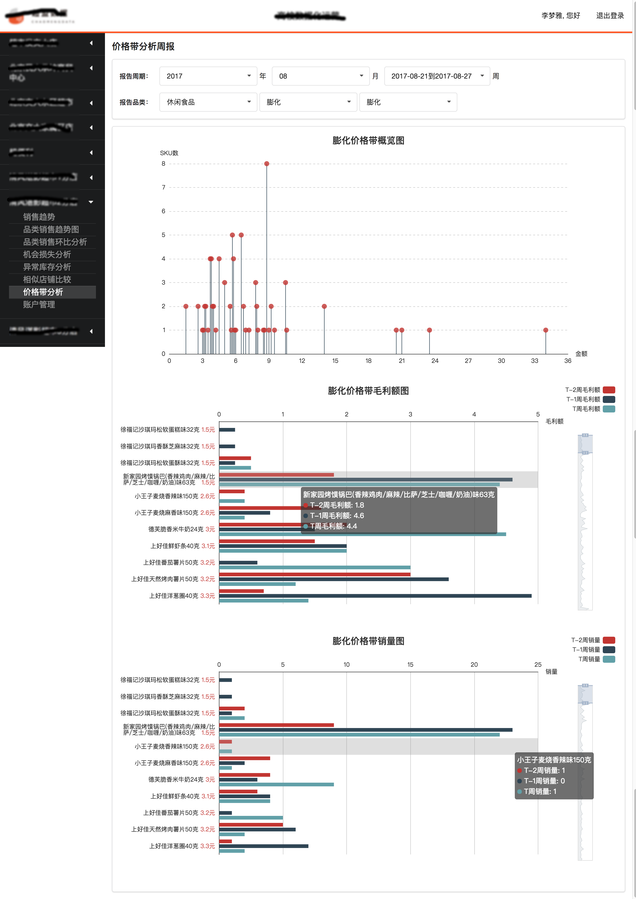
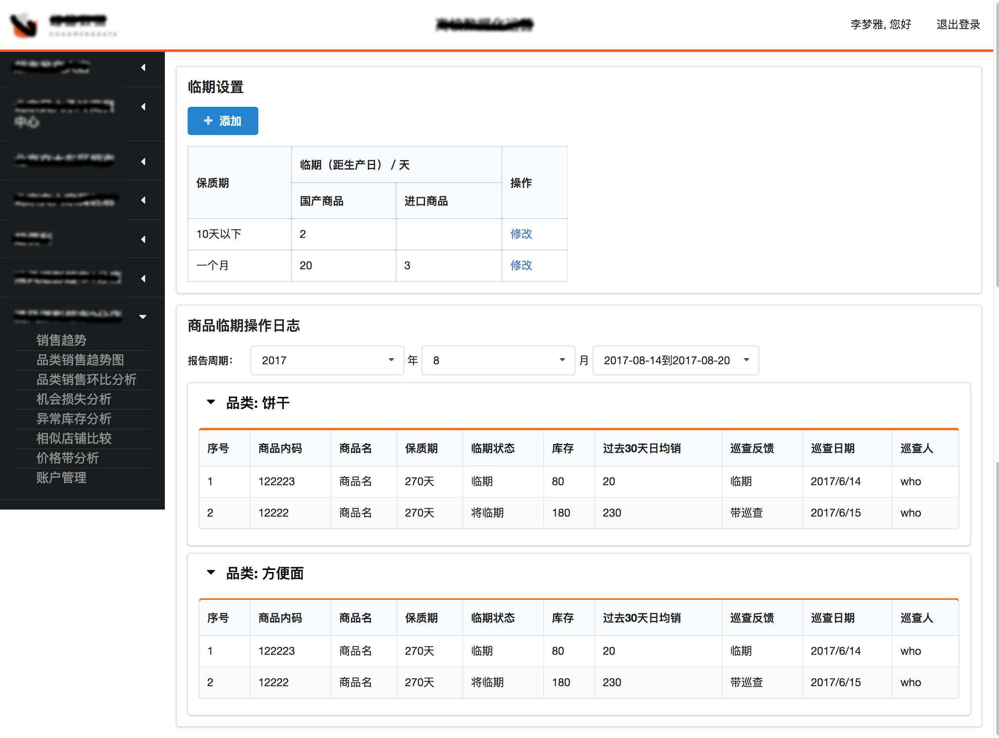
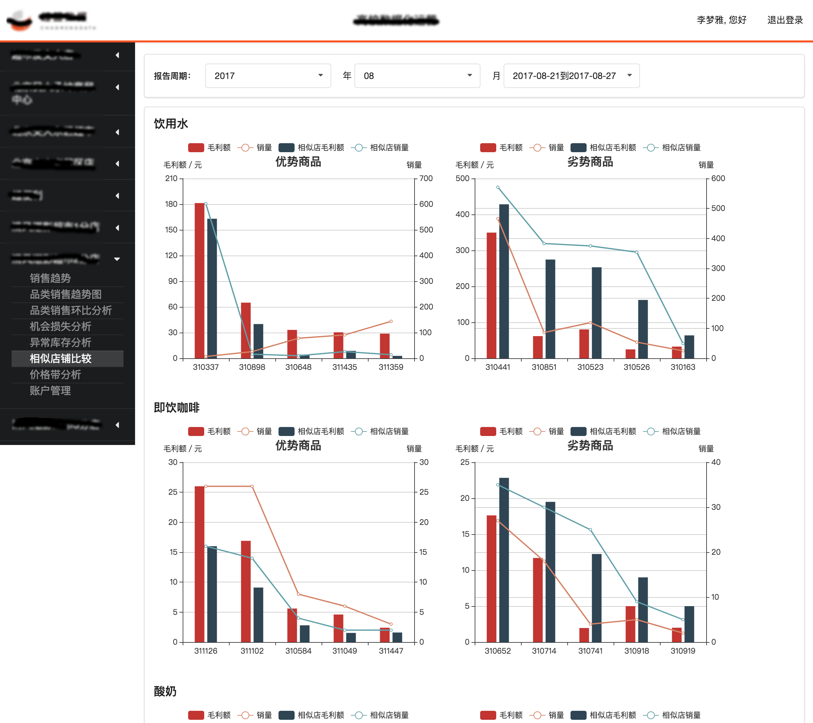
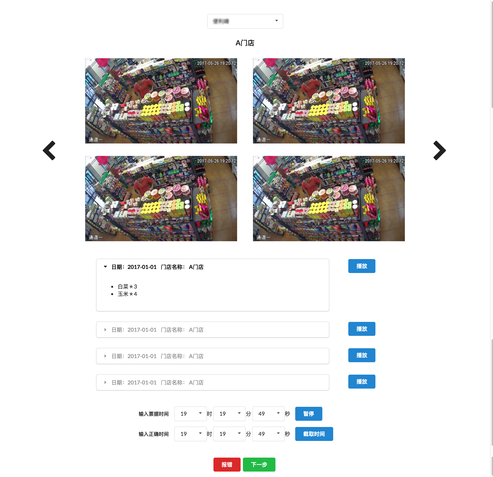
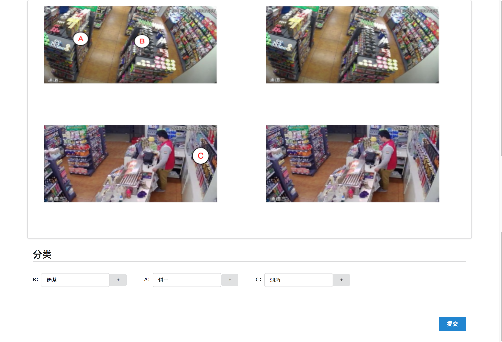

#### 加店工具

#### 加店工具 ([shopTool](https://github.com/miyalee/side-project/tree/master/work-project/shopTool))

#### 数据后台 PC端 ([shopkeeper](https://github.com/miyalee/side-project/tree/master/work-project/shopkeeper))

#### 数据后台 移动端 ([shopkeeper-mobile](https://github.com/miyalee/side-project/tree/master/work-project/shopkeeper－mobile))

#### 高校数据化运营平台

#### 视频工具

