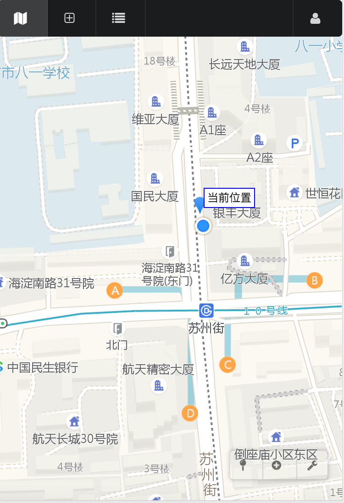
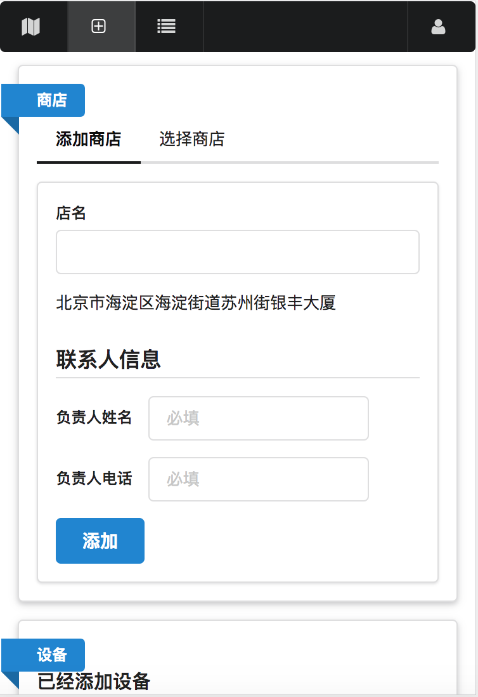
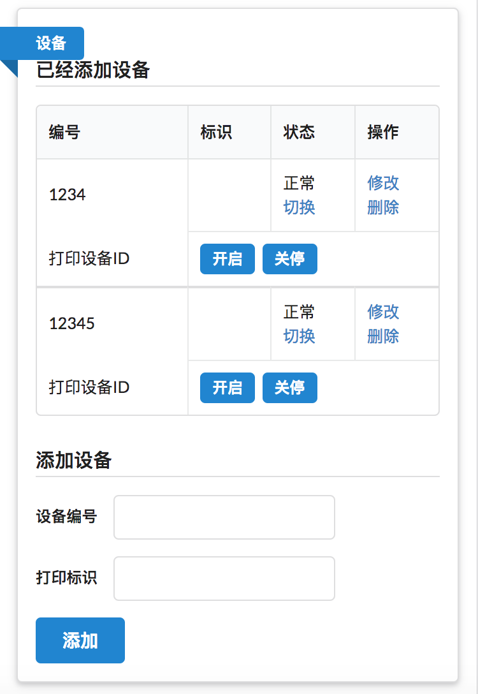
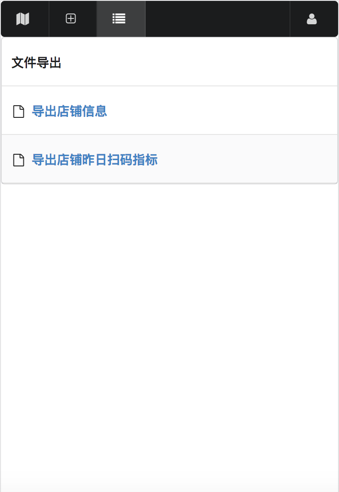

# 加店工具

> 记录门店地理位置和店内设备的工具

## 如何使用

``` bash
# 安装
$ npm install

# 在开发环境运行
$ npm run dev

# 在生产环境运行
$ npm run build
$ npm run start
```

免责声明：本项目的仅供个人学习欣赏之用，不得用于任何商业目的，不得以任何方式修改本作品，基于此产生的法律责任本人不承担连带责任之类的
