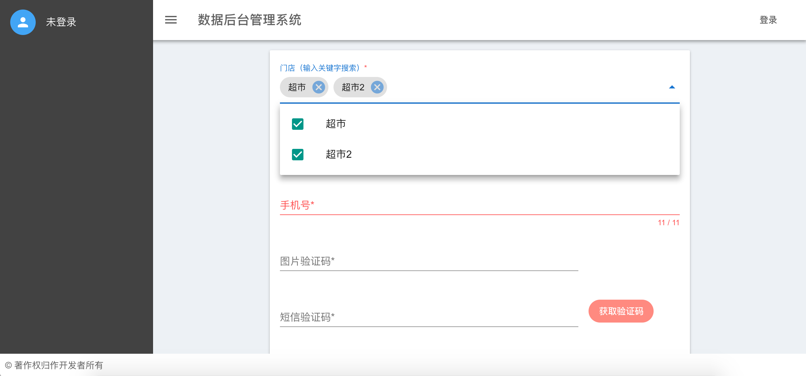
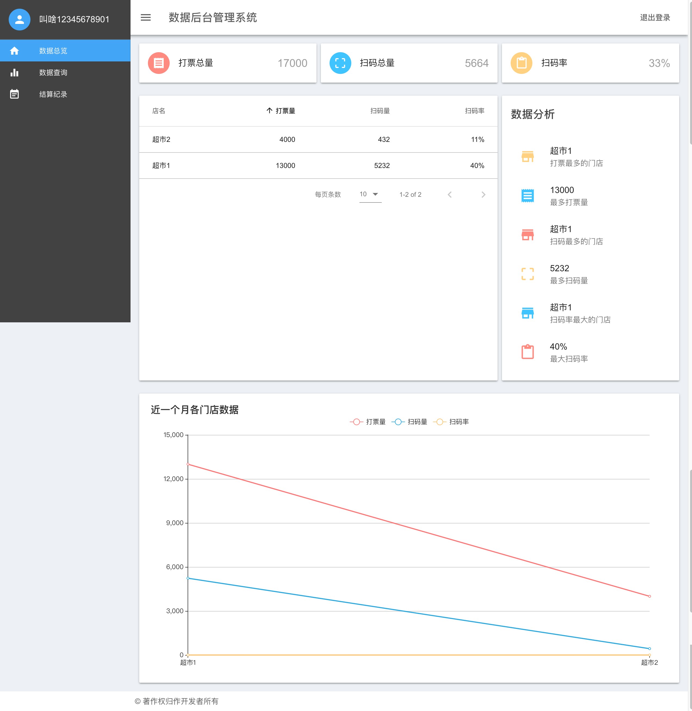
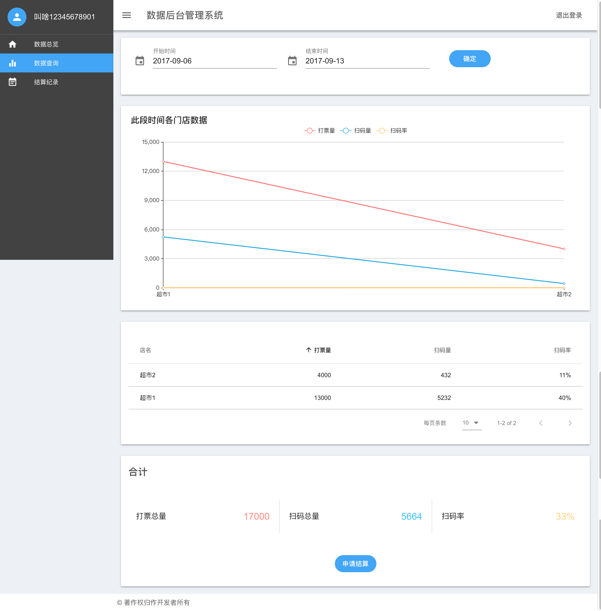
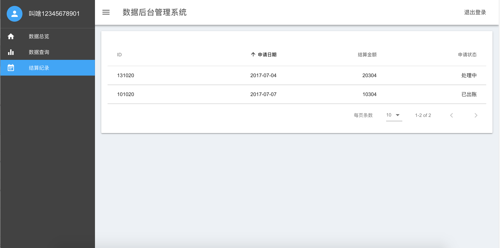

# 数据后台系统

> 对超市数据进行总体分析、分时段分析、提取结算等

## 如何使用

``` bash
# 安装
$ npm install

# 在开发环境运行
$ npm run dev

# 在生产环境运行
$ npm run build
$ npm run start
```

<sub>免责声明：本项目的仅供个人学习欣赏之用，不得用于任何商业目的，不得以任何方式修改本作品，基于此产生的法律责任本人不承担连带责任</sub>
